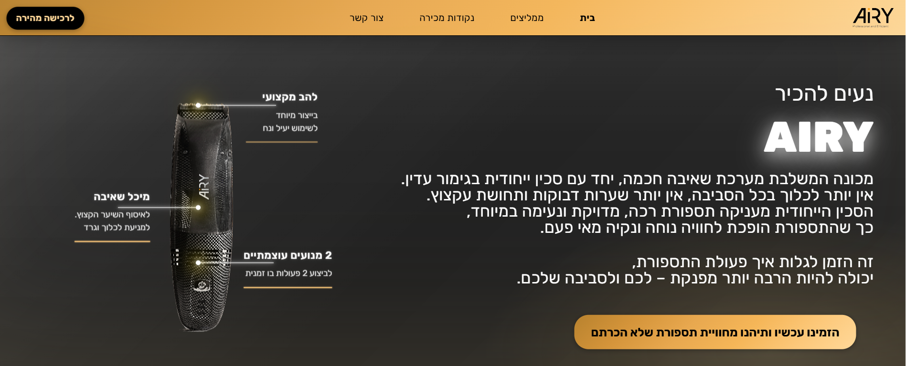
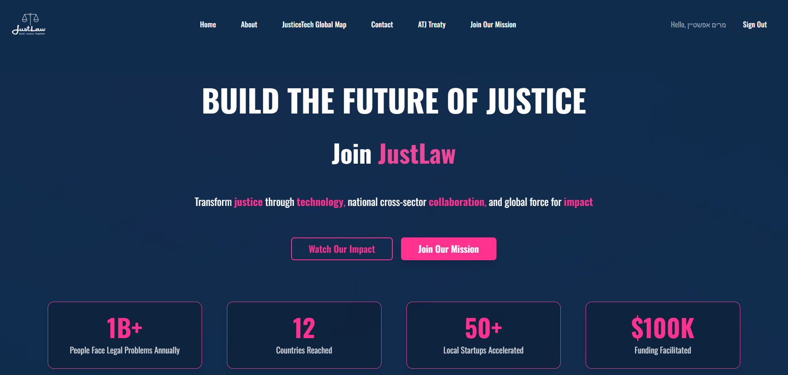

<h2> עמוד זה בתהליך פיתוח</h2>
  
# 👋 Hi, I'm Miryam Epstein

### Full Stack Developer
---
## Experience

### ✨ Airy - אתר מכירות ותדמית

<table>
<tr>
<td width="55%">
  

</td>
<td width="45%" valign="top">

#### ✨ Airy - אתר מכירות ותדמית

**ספטמבר 2025 - הווה | פרויקט פיתוח**

פיתוח אתר מכירות ותדמית למוצר חדשני, כולל הצגת יתרונות באייקונים מונפשים, אזור ממליצים, נקודות מכירה וטופס יצירת קשר מחובר ל־Google Sheets. שולבה אינטגרציה לעמוד סליקה. הפיתוח ב־React עם Tailwind ו־MUI, תוך הקפדה על רספונסיבי ועמידה בדרישות עסקיות.

**טכנולוגיות:**
- React • Tailwind • MUI • Google Sheets

 

  

</td>
</tr>
</table>

### ⚖️ JustLawIsrael - Legal Platform

<table>
<tr>
<td width="55%">
  

</td>
<td width="45%" valign="top">

#### ⚖️ JustLawIsrael - Legal Platform

**יולי 2025 | DiversiTech**

פיתוח Full Stack לפלטפורמה המשפטית JustLawIsrael, תוך ניהול והובלת צוות קטן, תכנון ויישום משימות מורכבות, קבלת החלטות טכנולוגיות והתאמת פתרונות.

**טכנולוגיות:**
- React • Node.js • Express • Supabase • Git

 

<!-- 

 -->

</td>
</tr>
</table>

---

## 🚀 My Projects

### 🎮 GameShop - E-Commerce Platform
<table>
<tr>
<td width="55%">
  

</td>
<td width="45%" valign="top">

#### 🎮 GameShop - E-Commerce Platform

**טכנולוגיות:**
- React • Redux • ASP.NET Core • Entity Framework • SQL Server

 

</td>
</tr>
</table>

---

### 🍳 Recipes Fullstack Application
<table>
<tr>
<td width="55%">
  

</td>
<td width="45%" valign="top">

#### 🍳 Recipes Fullstack Application

**טכנולוגיות:**
- Angular • Node.js • MongoDB

 

</td>
</tr>
</table>

---

## 📧 Contact Me

- 📧 **Email:** m0533123308@gmail.com
- 📱 **Phone:** 053-312-3308
