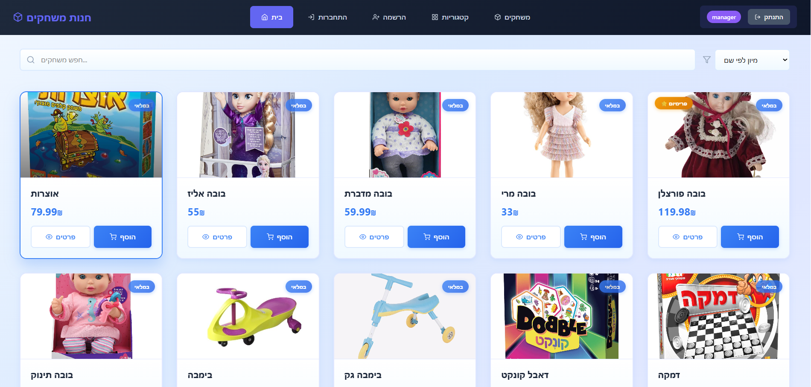
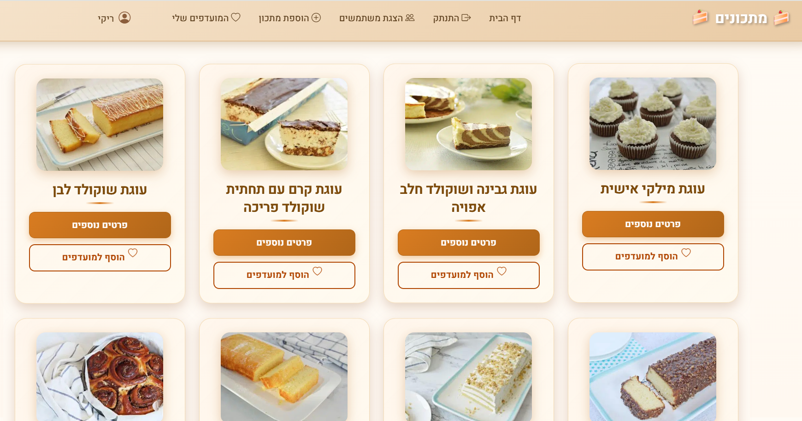

  
# 👋 Hi, I'm Miryam Epstein

### Full Stack Developer

---

## 🚀 My Projects

### 🎮 GameShop - E-Commerce Platform

**A modern, full-stack e-commerce platform for online game shopping**

Built with **React**, **.NET Core**, and **SQL Server**

  <a href="https://raw.githubusercontent.com/Miriam-Epstein/Miriam-Epstein/main/assets/Project_fullStake.mp4" target="_blank" style="text-decoration: none;">
    

      🎥 צפייה בסרטון הדמו
    

  </a>
  <a href="https://github.com/Miriam-Epstein/Project_fullStake" target="_blank" style="text-decoration: none;">
    

      🔗 גישה לרפרזיטורי
    

  </a>

#### Key Features:
- 🛒 Smart Shopping Cart with real-time updates
- 👤 Customer Dashboard with purchase history
- 🔧 Admin Panel for product management
- 🎨 Modern UI with beautiful blue gradients
- 📱 Fully responsive design

**Tech Stack:** React • Redux • ASP.NET Core • Entity Framework • SQL Server

---

### 🍳 Recipes Fullstack Application

**A complete full-stack recipe management application**

Built with modern web technologies

  <a href="https://raw.githubusercontent.com/Miriam-Epstein/Miriam-Epstein/main/assets/recipesFullstack.mp4" target="_blank" style="text-decoration: none;">
    

      🎥 צפייה בסרטון הדמו
    

  </a>
  <a href="https://github.com/Miriam-Epstein/recipesFullstack" target="_blank" style="text-decoration: none;">
    

      🔗 גישה לרפרזיטורי
    

  </a>

#### Key Features:
- 📝 Recipe management (add, edit, delete)
- 🔍 Search and filter recipes
- 📱 Responsive design
- 🎨 Modern user interface

**Tech Stack:** Full Stack Application

---

## 📊 Project Statistics

---

## 🛠️ Technologies I Use

---

## 📧 Contact Me

- 📧 **Email:** m0533123308@gmail.com
- 📱 **Phone:** 053-312-3308

---

**⭐ Star my repositories if you find them helpful! ⭐**

Made with 💙 by Miryam Epstein

