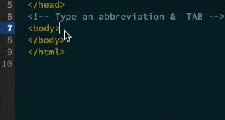

# 👋 Hi, I'm Miryam Epstein

### Full Stack Developer | Software Engineer

---

## 💫 About Me

System-oriented developer with a proactive mindset, strong personal responsibility, and initiative. Highly motivated with task management and interpersonal skills fostering effective teamwork, eager to contribute and grow in challenging environments.

- 🚀 Currently working at **SmartAIQ** startup as Full-Stack Developer
- 💼 Freelance Frontend Developer for **Airy** e-commerce project
- 🎓 Graduate of **Ultra Code Program by Kamatech** (Completed with Honors)
- 🌱 Passionate about learning new technologies and building user-focused solutions
- 📍 Based in Israel | 🗣️ Hebrew (Native), English (Professional)

---

## 🛠️ Technical Skills

**Programming Languages:**  

**Frontend:**  

**Backend:**  

**Databases:**  

**Tools & Technologies:**  

---

## 💼 Work Experience

### 🚀 Full-Stack Developer | SmartAIQ (Startup)
**October 2024 – Present**

- Develop end-to-end web applications, focusing on Frontend (React, Tailwind CSS, TypeScript)
- Build and maintain Backend services using Python (Django), including RESTful APIs and data management
- Collaborate within an Agile development team, contributing to efficient workflows and iterative delivery
- Utilize Git and GitHub for version control, code management, and team collaboration
- Leverage AI-based tools to optimize development processes and improve code efficiency

**Tech Stack:** React • TypeScript • Python • Django • Redux Toolkit • REST APIs • Tailwind CSS • Git

---

### 💼 Frontend Developer (Freelance) | Airy E-commerce
**September 2024 – Present**

- Lead development of a branding and e-commerce website using React, Tailwind CSS, and Material-UI
- Implement third-party integrations and cloud deployment with scalable, efficient solutions
- Use Git/GitHub and AI tools to streamline development processes
- Deliver high-quality, responsive, client-focused user experiences

**Tech Stack:** React • Tailwind CSS • Material-UI • Git

---

### ⚖️ Full-Stack Developer | DiversiTech - JustLawIsrael
**July 2024**

- Develop a full-stack legal platform using React, Node.js, Express, Supabase, and Git
- Lead a small team, coordinating tasks and ensuring efficient Agile workflows
- Design and implement complex end-to-end features to enhance user experience and system operations
- Use Git for version control and process optimization

**Tech Stack:** React • Node.js • Express • Supabase • Git

---

## 🚀 Projects

### 🎮 GameShop - E-Commerce Platform
**December 2024**

- Built an e-commerce platform with React, Redux, ASP.NET Core (C#), Web API, and SQL
- Implemented authentication, shopping cart, product catalog, and responsive UI
- Developed RESTful APIs and integrated Entity Framework for data management

**Tech Stack:** React • Redux • ASP.NET Core • C# • Entity Framework • SQL Server

---

### 🍳 Recipe Management System
**April 2025**

- Built a full-featured recipe app with Angular, Node.js, Express, and MongoDB
- Developed REST APIs, CRUD operations, reactive forms, and a responsive UI
- Implemented search and filter functionality for recipes

**Tech Stack:** Angular 18 • Node.js • Express • MongoDB

---

## 🎓 Education

**Professional Software Development Diploma**  
Ministry of Labor (MAHAT) | 2023 – 2025  
Ultra Code Program by Kamatech - **Completed with Honors**

**High School Diploma**  
Specialized in Information Technology and Computer Science | 2020 – 2023

---

## 📫 Contact Me

📧 **Email:** m0533123308@gmail.com

📱 **Phone:** +972-53-312-3308

💼 **GitHub:** [github.com/Miriam-Epstein](https://github.com/Miriam-Epstein)

