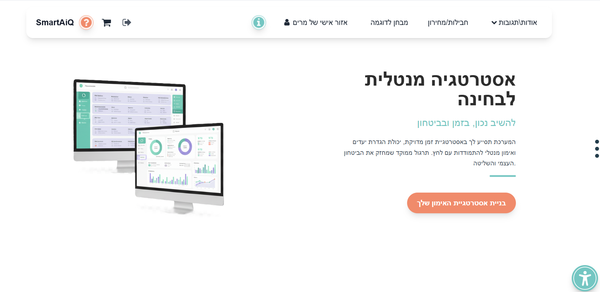
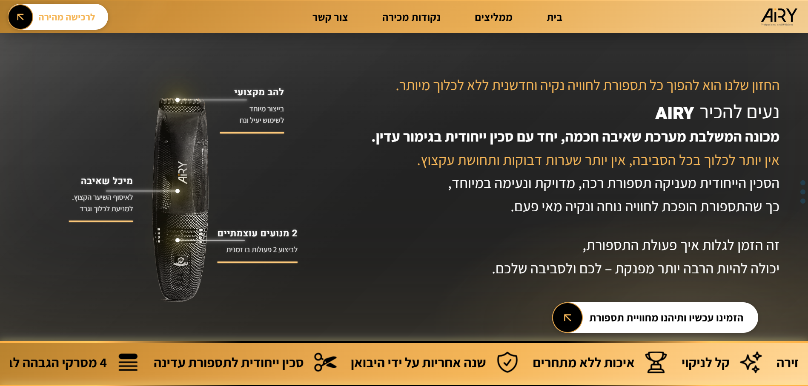
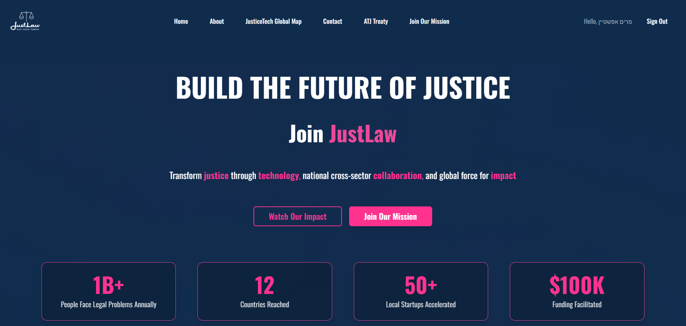
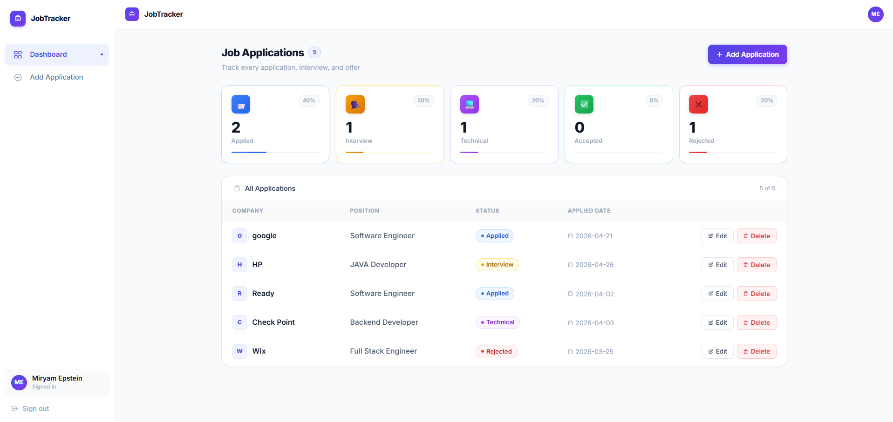
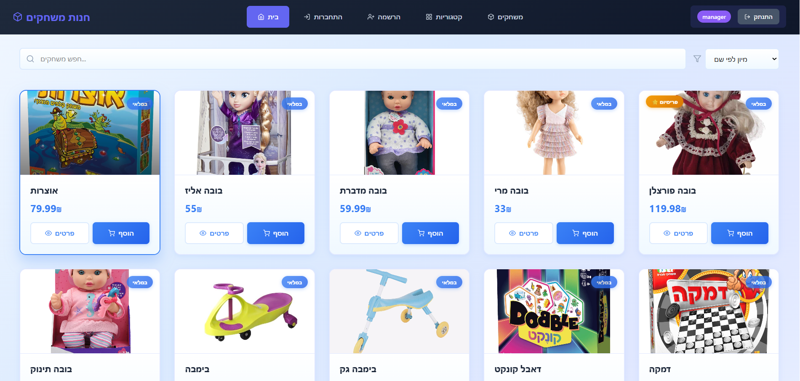

# 👋 Hi, I'm Miryam Epstein

### Full Stack Developer | Software Engineer

---

## 💼 Work Experience

### 🚀 Full-Stack Developer | SmartAIQ (Startup)
** 2025 October – Present**

<table>
<tr>
<td width="50%">

</td>
<td width="50%" valign="top">

- Develop end-to-end web applications, focusing on Frontend (React, Tailwind CSS, TypeScript)
- Build and maintain Backend services using Python (Django), including RESTful APIs and data management
- Collaborate within an Agile development team, contributing to efficient workflows and iterative delivery
- Utilize Git and GitHub for version control, code management, and team collaboration
- Leverage AI-based tools to optimize development processes and improve code efficiency

**Tech Stack:** React • TypeScript • Python • Django • Redux Toolkit • REST APIs • Tailwind CSS • Git

</td>
</tr>
</table>

---

### 💼 Frontend Developer (Freelance) | Airy E-commerce
** 2025 - 2026 **

<table>
<tr>
<td width="50%">

</td>
<td width="50%" valign="top">

- Lead development of a branding and e-commerce website using React, Tailwind CSS, and Material-UI
- Implement third-party integrations and cloud deployment with scalable, efficient solutions
- Use Git/GitHub and AI tools to streamline development processes
- Deliver high-quality, responsive, client-focused user experiences

**Tech Stack:** React • Tailwind CSS • Material-UI • Git

</td>
</tr>
</table>

---

### ⚖️ Full-Stack Developer | DiversiTech - JustLawIsrael
** 2025 **

<table>
<tr>
<td width="50%">

</td>
<td width="50%" valign="top">

- Develop a full-stack legal platform using React, Node.js, Express, Supabase, and Git
- Lead a small team, coordinating tasks and ensuring efficient Agile workflows
- Design and implement complex end-to-end features to enhance user experience and system operations
- Use Git for version control and process optimization

**Tech Stack:** React • Node.js • Express • Supabase • Git

</td>
</tr>
</table>

---

## 🚀 Projects

### 💼 JobTracker - Job Search Management System
** 2026 **

<table>
<tr>
<td width="50%">

</td>
<td width="50%" valign="top">

- Developed a job tracking system using Java Spring Boot, Spring Security (JWT), React, and Docker
- Designed secure REST APIs, implemented CRUD operations, and integrated JPA with H2 database
- Built authentication system with JWT for secure user login and registration
- Implemented job application tracking with status management (Applied → Interview → Technical → Accepted/Rejected)

**Tech Stack:** Java • Spring Boot • Spring Security • JWT • JPA • H2 • React • Tailwind CSS • Docker

</td>
</tr>
</table>

---

### 🍳 Recipe Management System
** 2025 April **

<table>
<tr>
<td width="50%">

</td>
<td width="50%" valign="top">

- Built a full-featured recipe app with Angular, Node.js, Express, and MongoDB
- Developed REST APIs, CRUD operations, reactive forms, and a responsive UI
- Implemented search and filter functionality for recipes

**Tech Stack:** Angular 18 • Node.js • Express • MongoDB

</td>
</tr>
</table>

---

### 🎮 GameShop - E-Commerce Platform
** 2024 December**

<table>
<tr>
<td width="50%">

</td>
<td width="50%" valign="top">

- Built an e-commerce platform with React, Redux, ASP.NET Core (C#), Web API, and SQL
- Implemented authentication, shopping cart, product catalog, and responsive UI
- Developed RESTful APIs and integrated Entity Framework for data management

**Tech Stack:** React • Redux • ASP.NET Core • C# • Entity Framework • SQL Server

</td>
</tr>
</table>

---

## 📫 Contact Me

📧 **Email:** m0533123308@gmail.com

📱 **Phone:** +972-53-312-3308

💼 **GitHub:** [github.com/Miriam-Epstein](https://github.com/Miriam-Epstein)

